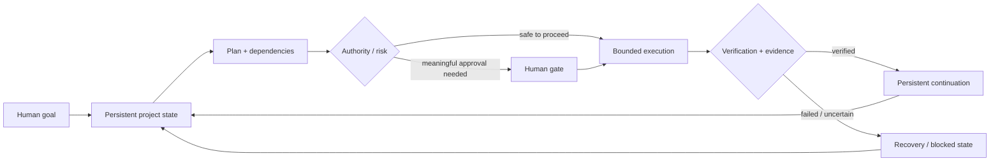

# KORAKO YOLAWANI

> **A human-directed operating layer for reliable AI-assisted work.**

**Stage:** prototype / evidence-building  
**Production-ready:** no  
**Canonical implementation:** private  
**Public purpose:** a safe diligence surface for the product thesis, architecture, evidence discipline and current limitations

Korako Yolawani is being designed to reduce the coordination burden that appears when AI work becomes multi-step, long-running and spread across models, tools and systems.

The product direction is not "more autonomy at any cost." The goal is to make complex AI-assisted work **easier to continue, easier to verify and safer to control**.

## Core problem

Today, the person often becomes the integration layer. They must remember what happened, copy context between systems, decide which tool should act next, notice missing dependencies, approve important actions, verify whether execution actually happened and recover when something fails.

Korako explores a different operating model:



The interface should stay simpler than the machinery underneath it. A person should mainly need to understand:

- where the work currently stands;
- what the next valid action is;
- what is blocked and why;
- what can safely run in parallel;
- when a meaningful approval is required;
- what evidence supports a claim that something is complete.

## Design principles

1. **Human authority** — consequential decisions remain explicitly governed.
2. **Persistent state** — projects should survive session and tool boundaries.
3. **Dependency-aware execution** — prerequisites matter.
4. **Risk-proportional permission** — not every action needs the same gate.
5. **Tool/model neutrality** — tools and models are replaceable capabilities.
6. **Verification before trust** — important completion claims require evidence.
7. **Recovery by design** — failures should lead to explicit recovery paths, not silent drift.
8. **Safe parallelism** — independent reversible work should not be forced into a single serial queue.
9. **Less human postman work** — the system should reduce unnecessary manual transfer, copying and coordination between tools.

## Evidence discipline

Korako uses a deliberately strict state distinction:

```text
PREPARED != EXECUTED != VERIFIED != PUBLICLY REPRODUCED
```

A polished interface, an AI statement or a successful local experiment is not automatically proof that a production capability exists.

Public claims should stay narrower than the strongest available evidence.

## Current evidence boundary

Private development has exercised prototype work around governed workflows, verification, evidence contracts, bounded execution, safe-parallelism rules, recovery concepts and local bridge experiments.

The public repository does **not** expose the canonical implementation, detailed security boundaries, credentials, machine-specific configuration or private operational evidence chains.

For the sanitized evidence surface, see the **[Public Evidence Index](KORA_EVIDENCE_INDEX.md)**.

Some evidence files still use **KORA** as a legacy engineering identifier. **Korako Yolawani is the current public product identity.** Legacy names are retained where changing them could damage evidence continuity or historical traceability.

## What Korako is not claiming today

Korako is not currently presented as:

- a finished commercial product;
- a production-ready autonomous-agent platform;
- a foundation model;
- proof of product-market fit;
- proof that private prototype results generalize to production;
- a replacement for human decision-making.

## Next credibility milestones

The strongest next steps are measurable rather than promotional:

1. a repeatable end-to-end Golden Demo on non-sensitive workflows;
2. visible acceptance criteria and failure cases;
3. independent technical review;
4. deliberate recovery tests with injected failures;
5. pilot measurements showing reduced user burden without weakening human control;
6. a clean public product surface that reveals enough to evaluate the system without exposing the private core.

## Collaboration

The project is especially open to:

- a technical co-founder / lead engineer;
- backend, systems and reliability engineering review;
- security and permission-model review;
- AI orchestration and evaluation expertise;
- product/UX collaboration;
- pilot partners with measurable multi-step workflows.

---

**Korako Yolawani — the next right step, without losing the human who owns the journey.**
