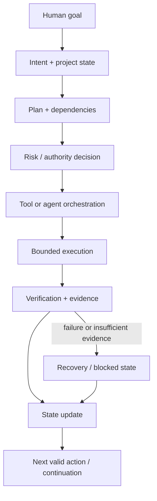

# Korako Yolawani - Public Showcase

> **A human-directed operating layer for reliable AI-assisted work.**

**Snapshot date:** 2026-09-03
**Public product:** Korako Yolawani
**Internal orchestration core:** KORA
**Dedicated public repository:** https://github.com/vcheeko/korako-yolawani

**Stage:** prototype / evidence-building  
**Production-ready:** no  
**Canonical KORA core source public:** no — security-sensitive and canonical engineering remain private

This document is deliberately a **public diligence surface**, not a source-code release. It explains what Korako Yolawani is trying to solve, how the KORA core is structured at a high level, what has been exercised internally, what has changed since the earlier 2026-08-28 snapshot, and what is still unproven. The dedicated `korako-yolawani` repository is now the preferred public product entry point; this file remains the longer historical/engineering narrative.

## The problem

Capable AI can perform individual tasks, but serious multi-step work still pushes a large operational burden back onto the user:

- remembering state across sessions;
- choosing the right tool or agent;
- respecting dependencies;
- knowing when approval is required;
- distinguishing "requested" from "actually executed";
- verifying that execution succeeded;
- recovering after failure;
- coordinating parallel work without corrupting canonical state.

KORA explores an operating layer between **human intent** and **AI/tool execution**.

## Core hypothesis

A reliable AI operating layer should combine:

1. **Natural-language control** — goals first, not command memorization.
2. **Persistent project state** — done, active, blocked, next and why.
3. **Dependency-aware planning** — work proceeds only when prerequisites are satisfied.
4. **Risk-proportional authority** — low-risk work can flow; consequential work gets stronger gates.
5. **Tool/model neutrality** — models and tools are replaceable capabilities, not the identity of the system.
6. **Verification before trust** — important completion claims require evidence.
7. **Recovery-aware execution** — reversible actions, checkpoints and explicit failure states.
8. **Human authority** — the system can coordinate work without silently taking ownership of consequential decisions.

## High-level architecture



A useful KORA interaction should feel much simpler than this diagram: the complexity belongs behind the interface, while the person sees the **current state, next valid action, meaningful blockers and approvals that actually matter**.

## Prototype evidence boundary

Private development has implemented or substantially exercised prototype work around:

- versioned governance and human-authority rules;
- controlled and fail-closed workflow behavior;
- request → authorization → execution → verification → state-update semantics;
- review and evidence workflows;
- read-only and simulation-oriented validation paths;
- safe-parallelism rules for independent, reversible work;
- bounded local execution / bridge experiments;
- recovery and continuation concepts.

These statements describe **internal prototype evidence**, not independent public verification. This showcase intentionally does not publish implementation details, machine-specific configuration, credentials, exact security boundaries, internal hashes or operational evidence chains.

A reviewer should therefore treat the items above as **claims backed by private project evidence, not as publicly reproduced results**.

## Development since 2026-08-28

The project has moved materially beyond the earlier evidence snapshot. Sanitized, evidence-backed progress includes:

- the public naming model is now explicit: **Korako Yolawani** is the product, **KORA** is the internal core and **Mira** is the conversational interface;
- a human-facing journey/workflow shell, read-only shared-workstream projection and bounded runner-status surface have been integrated in private development;
- a standalone persistent runner has been exercised with bounded read-only capabilities, crash/restart handling and fail-closed scope checks;
- a one-click local Windows launch path has been exercised while Windows startup installation remains behind a separate Human Gate;
- Windows state continuity has been hardened against real file-lock failures using validated generation fallback rather than unsafe overwrite;
- a hash-bound project-write adapter has been exercised with stale-hash rejection and without granting arbitrary shell, merge or deploy authority;
- the client interaction layer now binds the locked **IZBOR + recommendation + no-dead-end** policy;
- a fail-closed LinkedIn bridge and read-only OAuth canary path have been prepared without claiming that an account is connected or that profile-edit authority exists;
- a selected Personal Alpha candidate now passes **152/152 repository tests**, TypeScript typecheck, production build and GitHub CI on its exact head;
- the exact-head physical Windows/PWA Golden acceptance for that selected candidate is still pending and is not represented as complete;
- a dedicated public `korako-yolawani` repository has been created with a reproducible synthetic evidence-contract harness and passing public CI on the merged public flagship surface; the full public Golden runtime is still pending.

These are meaningful productization steps, but they do not change the overall public status from **prototype / evidence-building**.

## What Korako Yolawani is not

Korako Yolawani is not currently:

- a foundation model;
- a production-ready autonomous agent platform;
- a replacement for human decision-making;
- a claim that every workflow should be automated;
- a finished commercial product;
- proof of product-market fit;
- proof that private prototype results generalize to production environments.

## Current engineering target

The current frontier is no longer simply "build a small end-to-end core." Two narrower proof obligations now matter most:

1. **Personal Alpha exact-head Windows Golden** - run the selected integrated candidate on the physical Windows host and verify loopback runtime, restart/recovery, Human Gate UX, PWA install/offline behavior and the No-Postman measurement boundary on that exact head.
2. **Public Golden runtime** - connect plan, authority, bounded execution, evidence, independent verification, persistent state and recovery in one clean-clone public runtime without exposing the private KORA core.

After those, the credibility path is independent technical review and low-risk pilot evidence.

The governing rule remains:

```text
PREPARED != EXECUTED != VERIFIED != PUBLICLY REPRODUCED
```

A CI-green candidate is not automatically a Windows Golden result, and a public evidence-contract verifier is not automatically a reproduction of the private runtime.

## Human / AI responsibility split

KORA is being developed with extensive AI assistance. That is disclosed rather than hidden.

**Miha Tavčar:** product vision, systems thinking, workflow/governance design, acceptance criteria, AI-assisted prototyping, testing direction and project decisions.

**AI tools/models:** research assistance, implementation assistance, critique, documentation, test generation and review support where appropriate.

**Required discipline:** AI output is not automatically accepted as truth or completion. Important claims should be challenged through tests, evidence, independent review or explicit human judgment proportional to consequence.

## Public / private boundary

### Safe to discuss publicly

- problem and product thesis;
- high-level architecture;
- design principles;
- prototype stage and known limitations;
- collaboration needs;
- non-sensitive demonstration results when deliberately released.

### Private by design

- canonical internal rule registers;
- detailed execution implementation;
- exact approval and security boundaries;
- credentials or machine-specific configuration;
- private operational logs and evidence chains;
- unpublished IP-sensitive material.

## What would materially increase confidence

The next credibility upgrades are intentionally measurable:

1. a reproducible public Golden Demo using non-sensitive tasks;
2. visible acceptance tests and pass/fail criteria;
3. a small public evaluation set comparing KORA-assisted work with a manual baseline;
4. independent technical review of architecture and failure handling;
5. documented recovery from deliberately injected failures;
6. pilot evidence showing reduced user burden without hiding risk.

## Collaboration

KORA would benefit most from:

- a technical co-founder / lead engineer with strong backend and systems judgment;
- reliability and security engineering review;
- AI orchestration and evaluation expertise;
- product/UX work focused on making governed automation feel simple;
- pilot partners willing to define measurable real-world workflows.

---

**The ambition is large; the public claims are intentionally narrow. Evidence before scale.**
